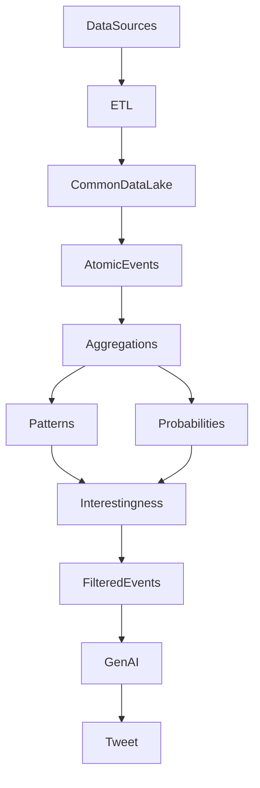

# 🏈 Data Processing & Story Generation Pipeline

This documentation captures the full architecture and flow of a data-driven sports analytics system — from ingesting raw statistics to generating compelling social media narratives.

---

## 📘 Stage 1: Data Sources & ETL

### Overview
This stage ingests diverse sports data from multiple sources and transforms them into a standardized format for downstream processing. The data spans multiple time periods and comes in different formats, requiring tailored ETL pipelines for each source.

### Data Sources

| Source         | Format | Time Coverage     | Granularity                  | Notes                                         |
|----------------|--------|-------------------|-------------------------------|-----------------------------------------------|
| **Genius**     | JSON   | 2014–present      | Game-level (2014–2020), Quarter-level (2021–present) | API-based sports stats (football & basketball) |
| **StatCrew**   | XML    | ~1998–2013        | Game-level                   | Legacy format requiring custom parsers       |
| **Record Book**| PDF    | Varies by school  | Aggregated (not game-specific)| Manually extracted historical records         |
| **Others**     | Mixed  | TBD               | TBD                           | Placeholder for additional sources            |

### Current ETL Implementation

- **Tooling:** Apache Hop
- **Note:** Each source has custom ETL pipelines to normalize formats into a unified schema.

---

## 📘 Stage 2: Common Data Lake

### Overview
The **Common Data Lake (CDL)** stores normalized, structured statistics organized by **entity** and **statistical period**.

### Entities and Periods

- **Entity Types:** Player, Team
- **Statistical Periods:** Game, Season, Career

### Tables

| Table                          | Entity  | Period     | Notes                                      |
|-------------------------------|---------|------------|--------------------------------------------|
| `player_game_statistics`      | Player  | Game       | With game metadata and player identifiers  |
| `player_season_statistics`    | Player  | Season     | Aggregated per season                      |
| `player_career_statistics`    | Player  | Career     | Multi-season totals                        |
| `team_game_statistics`        | Team    | Game       | Team performance per game                  |
| `team_season_statistics`      | Team    | Season     | Team-level season summaries                |

- Stored in **PostgreSQL**
- Fields like `season`, `player_name`, and `team_name` enable traceability across stat periods

---

## 📘 Stage 3: Atomic Event Extraction & Aggregation

### Overview
This stage transforms structured game-level statistics into **fine-grained atomic events** and computes contextual statistics over various **population types**.

> While designed to support multiple stat periods, the current implementation is **limited to game-level data**.

### 🔄 Transformation: From PGS to Atomic Events

#### Example `player_game_statistics` Record:
```json
{
  "playername": "BENSON, TREY",
  "teamname": "Florida St.",
  "opponentteamname": "Virginia Tech",
  "gamedate": "2023-10-07",
  "srushingyardsnet": 200,
  "srushingattempts": 11
}
```

#### Becomes Multiple Atomic Events:
| Player        | Team        | Date       | Opponent       | Stat Type         | Value |
|---------------|-------------|------------|----------------|-------------------|--------|
| BENSON, TREY  | Florida St. | 2023-10-07 | Virginia Tech  | sRushingYardsNet  | 200    |
| BENSON, TREY  | Florida St. | 2023-10-07 | Virginia Tech  | sRushingAttempts  | 11     |

---

### 👥 Population Types

Each population defines a contextual group of atomic events (e.g., career stats, opponent-specific stats, etc.).

Population Types (Groupings):
- Player: `[playerID, stat]`, `[playerID, opponentTeamName, season, stat]`, ...
- Team: `[teamName, season, stat]`, `[teamName, opponentConferenceName, stat]`, ...
- Position/Class/Conference-based: `[position, season, stat]`, ...
- Global: `[season, stat]`, `[stat]`

> Over 40 population types supported.

---

### 📊 Aggregation Metrics

For every `(population, stat)` pair:
- `sum`, `count`, `max`, `min`, `mean`, `std`
- `rank`: position within parent population

---

### 📐 Quantiles

- Computed for each population.
- Used to set dynamic thresholds for pattern detection (e.g., 90th percentile rushing yards).

---

### ⏳ Time Bounds

- For each population, track **milestones** (e.g., first time, most recent time a stat crossed a threshold).
- Enables queries like:
  > “In how many games since the last 3 years did X achieve more than the 90th percentile in rushing yards?”

---

## 📘 Stage 4: Pattern Detection

### Types of Patterns

| Type    | Definition                                           | Example                                    |
|---------|------------------------------------------------------|--------------------------------------------|
| Streak  | Consecutive games over a threshold                  | 5 straight games with 100+ rushing yards   |
| NTIMES  | Non-consecutive game count over threshold           | 8 games this season with 2+ touchdowns     |
| LTW     | Last time a stat crossed a threshold                | Last 150+ yard game was in 2021 vs Clemson |

- Thresholds often come from **quantiles**
- Implemented as **SQL-based computations**

---

## 📘 Stage 5: Probability Calculations

### Purpose
Assign statistical significance to events and patterns using different probability types:

| Type          | Purpose                                         |
|---------------|-------------------------------------------------|
| Event Prob    | Based on normal distribution (μ, σ)             |
| Min-Max Prob  | Relative to min/max values in population        |
| Streak Prob   | Rarity of a streak given its length/threshold   |
| LTW Prob      | How long ago the event last occurred            |
| Rank Prob     | Percentile rank within a broader population     |

- Computed as **log-probabilities**
- Context-aware: incorporates stat type, opponent, time, and entity
- Feeds directly into **interestingness modeling**

---

## 📘 Stage 6: Interestingness & Story Generation

### 🔥 Interestingness

A scoring function combining:
- **Statistical Rarity** (Stage 5)
- **Social Media Popularity** (e.g., player mentions, engagement)

> Learned model used to rank and filter high-potential stories.

---

### 🧹 Filtered Events & Patterns

- Only events/patterns above a defined **interestingness threshold** are passed forward.

---

### ✍️ Tweet Generation (GenAI)

- Uses **Generative AI** to transform structured events into stories
- Template-enhanced prompting for consistency
- Context-aware outputs:
  - *“Trey Benson rushed for 200 yards — most by an FSU RB since 2019.”*
  - *“FSU has had a 100-yard rusher in 4 straight games.”*

---

## ✅ End-to-End Summary



---

## 📂 Output Options

This doc was generated collaboratively through Q&A and can be exported as:
- Markdown (✓)
- PDF
- Google Doc
- Website documentation (Docusaurus/GitBook)

Let me know if you'd like any of those!

